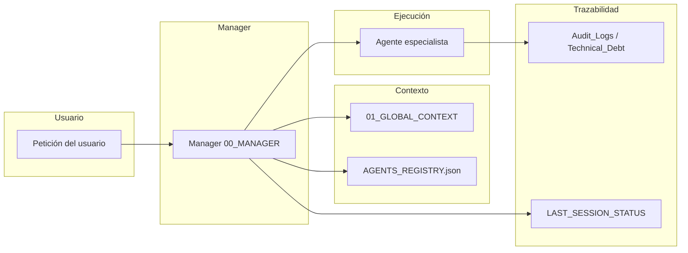
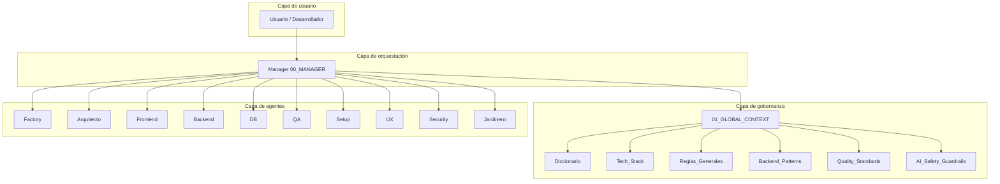
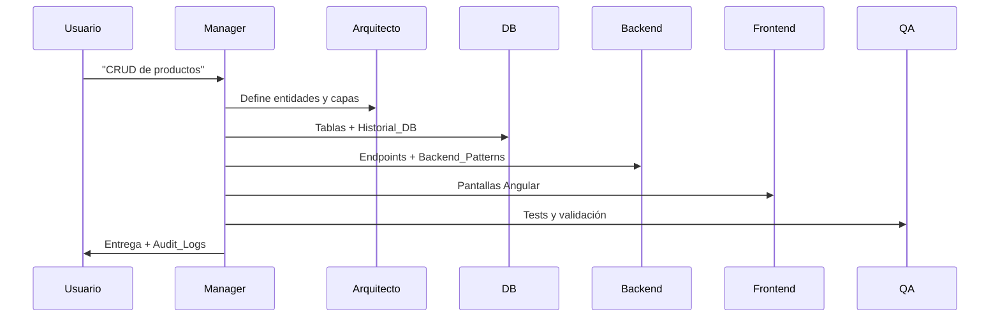
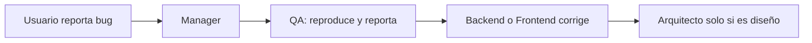
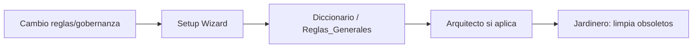

# 📘 Manual de Funcionamiento del IA Manager Template

**Sistema de Gobernanza y Orquestación IA (Antigravity Elite)**  
Este manual describe el funcionamiento, las funcionalidades, las responsabilidades y el uso del sistema para leerlo y comprenderlo con rapidez.

---

## 📑 Índice

1. [¿Qué es este sistema?](#1-qué-es-este-sistema)
2. [Arquitectura visual](#2-arquitectura-visual)
3. [Estructura de carpetas y responsabilidades](#3-estructura-de-carpetas-y-responsabilidades)
4. [Componentes principales](#4-componentes-principales)
5. [Funcionalidades del sistema](#5-funcionalidades-del-sistema)
6. [Funciones y responsabilidades](#6-funciones-y-responsabilidades)
7. [Flujos de trabajo](#7-flujos-de-trabajo)
8. [Uso en el día a día](#8-uso-en-el-día-a-día)
9. [Seguridad y calidad](#9-seguridad-y-calidad)
10. [Configuración e inicio](#10-configuración-e-inicio)
11. [Referencias rápidas](#11-referencias-rápidas)

---

## 1. ¿Qué es este sistema?

El **IA Manager Template** es una **plantilla de gobernanza y orquestación** que convierte un asistente IA (p. ej. Antigravity/Cursor) en un **equipo de desarrollo coordinado**: un Manager que recibe tus peticiones, consulta normas y contexto, y **delega** la ejecución en agentes especializados (Backend, Frontend, DB, QA, etc.), siguiendo reglas técnicas fijas y trazabilidad.

| Concepto | Descripción |
|----------|-------------|
| **Orquestación** | El Manager no ejecuta código; asigna la tarea al agente correcto y supervisa que se cumplan las normas. |
| **Gobernanza** | Diccionario, Tech Stack, patrones Back/Front, guardrails y estándares de calidad que la IA **no puede violar**. |
| **Trazabilidad** | Auditoría (Audit_Logs), deuda técnica (Technical_Debt), historial de BD y checkpoint de sesión (LAST_SESSION_STATUS). |

---

## 2. Arquitectura visual

### 2.1 Flujo general: de la petición al resultado



**Resumen:** El usuario pide algo → el Manager lee contexto y registro de agentes → delega en un agente → el agente ejecuta siguiendo las normas → se registra la actividad y, si aplica, se actualiza el checkpoint de sesión.

### 2.2 Jerarquía del ecosistema



---

## 3. Estructura de carpetas y responsabilidades

### 3.1 Árbol de carpetas

```
IA_MANAGER_TEMPLATE/
├── .agent/                        # Configuración nativa (Antigravity/Cursor)
│   ├── instructions.md            # Aislamiento, checkpoints, rutas relativas
│   └── workflows/
│       ├── ia-init.md             # Flujo de inicialización (/ia-init)
│       └── session-stop.md        # Cierre de sesión
├── .cursorrules                   # Regla del AI Manager (placeholders)
├── 00_CORE_MANAGER/               # Cerebro: orquestador y registro
│   ├── 00_MANAGER.md              # System prompt del Manager
│   ├── AGENTS_REGISTRY.json       # Registro de agentes (IDs, rutas, triggers)
│   ├── Audit_Logs.md              # Log de auditoría
│   └── Technical_Debt.md         # Deuda técnica
├── 01_GLOBAL_CONTEXT/             # Constitución: normas y contexto
│   ├── AI_Safety_Guardrails.md    # Límites inviolables
│   ├── Architecture_Decisions.md  # ADRs
│   ├── Backend_Patterns.md        # Patrones y normas Back
│   ├── Diccionario.md             # Entidades y términos de negocio
│   ├── Governance_Evolution.md     # Evolución de gobernanza
│   ├── Historial_DB.md            # Cambios de esquema BD
│   ├── LAST_SESSION_STATUS.md     # Checkpoint de sesión
│   ├── LAST_SESSION_STATUS_TEMPLATE.md
│   ├── Naming_Conventions.md     # Nomenclatura
│   ├── Quality_Standards.md       # DoD y estándares
│   ├── Reglas_Generales.md        # Reglas Front/Back/BD
│   └── Tech_Stack.md              # Versiones y herramientas
├── 02_AGENTS_REGISTRY/            # Definiciones de agentes
│   ├── 00_AGENT_FACTORY.md        # Generador de agentes
│   ├── 01_ARQUITECTO.md … 09_GARDENER.md
│   └── INDEX.md                   # Índice de agentes
├── 03_PROMPT_LIBRARY/             # Prompts maestros
│   ├── API_Endpoint.md
│   ├── CRUD_Generator.md
│   ├── Security_Audit.md
│   ├── UX_Polishing.md
│   └── README.md
├── DOCS/                          # Documentación
│   ├── MANUAL_FUNCIONAMIENTO.md   # Este manual
│   ├── WORKSPACE_ORCHESTRATOR_SETUP.md
│   ├── UI_STORYBOOK.md
│   └── ...
├── README.md
└── setup_project.ps1              # Script de hidratación (nombre, código)
```

### 3.2 Responsabilidad por carpeta

| Carpeta / archivo | Responsabilidad |
|-------------------|-----------------|
| **00_CORE_MANAGER** | Orquestación: quién hace qué, registro de agentes, logs de auditoría y deuda técnica. |
| **01_GLOBAL_CONTEXT** | Gobernanza: qué stack usar, cómo nombrar, qué patrones seguir, qué no se puede hacer (guardrails), checkpoint de sesión. |
| **02_AGENTS_REGISTRY** | Definición de cada agente: misión, reglas de oro, protocolo de interacción, alcance (SCOPE). |
| **03_PROMPT_LIBRARY** | Plantillas de prompts para CRUD, API, UX y Security; uso con contexto obligatorio. |
| **DOCS** | Manuales, configuración del orquestador en el workspace, UI Storybook. |
| **.agent/** | Instrucciones y workflows para el agente nativo (Antigravity/Cursor). |

---

## 4. Componentes principales

### 4.1 Manager (00_MANAGER)

- **Rol:** Orquestador. No escribe código; recibe la petición, consulta contexto y guardrails, identifica el agente adecuado y delega.
- **Consultas obligatorias:** Diccionario, AI_Safety_Guardrails, Architecture_Decisions, AGENTS_REGISTRY.json, ficha del agente en 02_AGENTS_REGISTRY.
- **Salidas:** Registro en Audit_Logs, validación con Quality_Standards y Naming_Conventions antes de dar por cerrada la tarea.

### 4.2 Contexto global (01_GLOBAL_CONTEXT)

- **Diccionario.md:** Entidades de negocio, reglas de negocio, glosario técnico (DTO, Repository, authGuard, IEntityDataService, etc.).
- **Tech_Stack.md:** Versiones de frameworks (Angular, NestJS, TypeORM, etc.) y herramientas (Jest, Karma, ESLint, etc.).
- **Reglas_Generales.md:** Estándares Front/Back, BD, calidad, documentación, checkpoints y mantenimiento (Jardinero).
- **Backend_Patterns.md:** Paginación, filtros dinámicos, Query Builder, módulos, DTOs, soft delete, fechas, casos de uso y errores a evitar.
- **AI_Safety_Guardrails.md:** Prohibiciones (no tocar Core, no DROP/TRUNCATE sin confirmación, secretos en .env, cambios de BD documentados).
- **Quality_Standards.md:** Definition of Done, seguridad, accesibilidad, testing.
- **LAST_SESSION_STATUS.md:** Última tarea, backlog y decisiones para retomar la sesión.

### 4.3 Agentes (02_AGENTS_REGISTRY)

Cada ficha `*.md` define: **misión**, **reglas de oro**, **stack técnico**, **protocolo de interacción** (Antigravity) y **constraints**. Los agentes son especialistas; el Manager los invoca según triggers y tipo de tarea.

### 4.4 Prompt Library (03_PROMPT_LIBRARY)

Prompts reutilizables para tareas recurrentes. Antes de usarlos, la IA debe tener en cuenta Diccionario, Tech_Stack, AI_Safety_Guardrails y, para Back, Backend_Patterns.

---

## 5. Funcionalidades del sistema

| Funcionalidad | Descripción |
|---------------|-------------|
| **Delegación automática** | El usuario pide una tarea en lenguaje natural; el Manager asigna el agente (Backend, Frontend, DB, QA, etc.) según el tipo de tarea. |
| **Gobernanza técnica** | Todas las respuestas se alinean con Diccionario, Tech_Stack, Reglas_Generales, Backend_Patterns y Naming_Conventions. |
| **Protección (Guardrails)** | Ningún agente puede modificar Core, ejecutar DROP/TRUNCATE sin confirmación, escribir secretos en código ni cambiar BD sin documentar en Historial_DB. |
| **Trazabilidad** | Auditoría en Audit_Logs; deuda técnica en Technical_Debt; cambios de esquema en Historial_DB. |
| **Continuidad de sesión** | LAST_SESSION_STATUS permite retomar el trabajo en otra sesión sin perder contexto. |
| **Calidad** | Validación contra Quality_Standards y Naming_Conventions; posibilidad de pedir auditoría QA o Security. |
| **Prompts maestros** | CRUD Master, API Endpoint, UX Polishing, Security Audit para acelerar tareas estándar. |
| **Orquestador único** | En un workspace con varios proyectos, una sola instancia del template en `.cursor/rules` sirve como fuente de agentes y normas. |

---

## 6. Funciones y responsabilidades

### 6.1 Manager

| Función | Responsabilidad |
|---------|-----------------|
| Contexto y seguridad | Consultar Diccionario, Guardrails y ADRs antes de actuar. |
| Identificación y delegación | Usar AGENTS_REGISTRY.json y 02_AGENTS_REGISTRY para elegir agente y cargar sus reglas. |
| Plan secuencial | Para tareas complejas (p. ej. CRUD), definir orden: DB → Backend → Frontend/UX → QA. |
| Log de auditoría | Registrar intención y agente en Audit_Logs.md. |
| Filtro de calidad | Verificar que el resultado cumpla Quality_Standards y Naming_Conventions. |
| Checkpoints | Leer LAST_SESSION_STATUS al inicio; actualizarlo al completar hitos o cambiar de tema. |

### 6.2 Agentes (resumen)

| Agente | Función principal |
|--------|-------------------|
| **Factory** | Crear o estandarizar nuevas fichas de agentes. |
| **Arquitecto** | Estructura, patrones y coherencia (módulos, capas). |
| **Frontend** | UI Angular (NgModules, Bootstrap, Material), rutas, servicios, componentes. |
| **Backend** | APIs NestJS, DTOs, repositorios, paginación, Swagger, ver Backend_Patterns. |
| **DB** | Modelado de tablas, migraciones, Historial_DB. |
| **QA** | Tests, bugs, refactor, cobertura. |
| **Setup** | Hidratar Diccionario y reglas iniciales (/ia-init). |
| **UX** | Diseño, estética, accesibilidad, coherencia visual. |
| **Security** | Auditoría de seguridad, secretos, vulnerabilidades. |
| **Jardinero** | Limpieza de documentación, reglas obsoletas, Governance_Evolution. |

### 6.3 Documentos de contexto (quién los usa)

| Documento | Usado por |
|-----------|-----------|
| Diccionario.md | Manager, Backend, Frontend, DB, Setup |
| Tech_Stack.md | Todos los agentes técnicos |
| Reglas_Generales.md | Manager, todos los agentes |
| Backend_Patterns.md | Manager, Backend, DB (para APIs y estructura Back) |
| AI_Safety_Guardrails.md | Manager, todos (filtro previo a cualquier acción) |
| Quality_Standards.md | Manager, QA, Security |
| Naming_Conventions.md | Manager, Backend, Frontend, DB |
| Historial_DB.md | DB, Backend (cambios de esquema) |

---

## 7. Flujos de trabajo

### 7.1 Nuevo CRUD completo



Orden típico: **Arquitecto → DB → Backend → Frontend → QA.**

### 7.2 Bug o error en funcionalidad existente



### 7.3 Cambio en reglas de negocio o gobernanza



---

## 8. Uso en el día a día

1. **Pedir la tarea en natural:** Por ejemplo: *"Crea una página de listado de clientes con filtros"*. No hace falta nombrar al agente; el Manager delega.
2. **Continuidad:** Al abrir una nueva sesión, el Manager lee LAST_SESSION_STATUS y puede resumir última tarea, backlog y decisiones.
3. **Seguridad:** Cualquier acción que viole AI_Safety_Guardrails (p. ej. tocar Core) será bloqueada o redirigida.
4. **Calidad:** Al terminar, puedes pedir *"Auditoría de calidad"* para que QA o Security revisen contra Quality_Standards.
5. **Atajos:** Consultar `02_AGENTS_REGISTRY/INDEX.md` para ver qué hace cada agente y `03_PROMPT_LIBRARY/README.md` para copiar prompts (CRUD Master, API Endpoint, UX Polishing, Security Audit).
6. **No editar agentes a mano:** Para cambiar el comportamiento de un agente se usa `02_AGENTS_REGISTRY/00_AGENT_FACTORY.md` (refactor controlado).

---

## 9. Seguridad y calidad

### 9.1 Guardrails (inviolables)

- No modificar **ningún archivo/carpeta Core**.
- No ejecutar **DROP TABLE** ni **TRUNCATE** sin confirmación explícita del usuario.
- No escribir **secretos** en código; usar **.env**.
- No cambiar **esquema de BD** sin documentar en **Historial_DB.md**.
- No instalar dependencias sin **soporte LTS** o con **CVE** conocidas.
- Agentes limitados a su **SCOPE**; el Arquitecto valida rutas nuevas.

### 9.2 Calidad

- **Quality_Standards.md:** Definition of Done, validación Back/Front, seguridad, accesibilidad, testing.
- **Naming_Conventions.md:** Nomenclatura de archivos, código, BD y API.
- Auditorías a petición: **QA** (tests, lógica) y **Security** (vulnerabilidades, secretos).

### 9.3 Checkpoint de sesión

- **LAST_SESSION_STATUS.md:** Última tarea, backlog, decisiones clave.
- El Manager lo **lee al inicio** de sesión y lo **actualiza** al completar hitos o al cambiar de tema.

---

## 10. Configuración e inicio

### 10.1 Primera vez (template en un proyecto)

1. Copiar el contenido de `IA_MANAGER_TEMPLATE` a la raíz del proyecto (o usar el template como orquestador único en el workspace).
2. Ejecutar `./setup_project.ps1` en PowerShell e introducir **Nombre del proyecto** y **Código** (ej. ECOM).
3. Abrir el chat con Antigravity y escribir `/ia-init` o *"Configura el proyecto"*; el Setup Wizard ayudará a rellenar el Diccionario.

### 10.2 Orquestador único en el workspace

Si el workspace tiene varios proyectos (Front, Back, etc.):

- Configurar **`.cursor/rules/`** en la **raíz del workspace** con una regla que apunte a este `IA_MANAGER_TEMPLATE`.
- No duplicar el template por proyecto; esta instancia es la **fuente única** de agentes y normas.
- Detalles: `DOCS/WORKSPACE_ORCHESTRATOR_SETUP.md`.

---

## 11. Referencias rápidas

| Necesito… | Dónde mirar |
|-----------|-------------|
| Entender la estructura y el flujo | Este manual, secciones 2 y 3; `README.md` |
| Saber qué hace cada agente | `02_AGENTS_REGISTRY/INDEX.md` |
| Reglas de comportamiento y estándares | `01_GLOBAL_CONTEXT/Reglas_Generales.md` |
| Patrones Back (paginación, filtros, módulos, etc.) | `01_GLOBAL_CONTEXT/Backend_Patterns.md` |
| Versiones y herramientas | `01_GLOBAL_CONTEXT/Tech_Stack.md` |
| Entidades y términos de negocio | `01_GLOBAL_CONTEXT/Diccionario.md` |
| Qué no se puede hacer | `01_GLOBAL_CONTEXT/AI_Safety_Guardrails.md` |
| Definition of Done y calidad | `01_GLOBAL_CONTEXT/Quality_Standards.md` |
| Cómo orquestar (Manager) | `00_CORE_MANAGER/00_MANAGER.md` |
| Prompts para CRUD, API, UX, Security | `03_PROMPT_LIBRARY/README.md` |
| Configurar orquestador en el workspace | `DOCS/WORKSPACE_ORCHESTRATOR_SETUP.md` |
| Fuente de verdad de orquestación | `.cursor/rules/ia-manager-orchestrator.mdc`. El `.cursorrules` dentro del template es refuerzo local; en conflicto, prevalece la regla en `.cursor/rules/`. |

---

*Manual generado para el IA Manager Template (Antigravity Elite). Para ampliar detalles, usar los enlaces de la tabla de referencias rápidas.*
