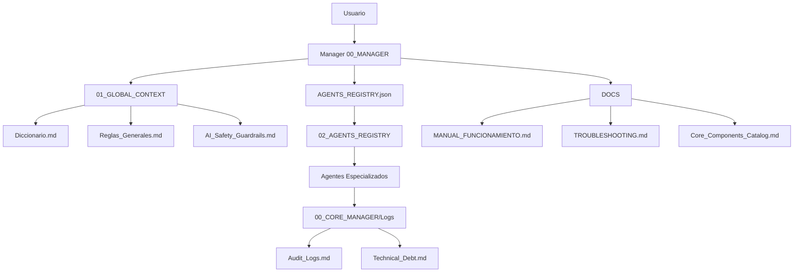

# 🗺️ Índice de Navegación del IA_MANAGER_TEMPLATE

Este documento es tu guía rápida para encontrar cualquier información en el sistema IA_MANAGER_TEMPLATE. Úsalo como punto de entrada cuando necesites localizar documentación específica.

---

## 📚 Búsqueda Rápida por Tema

### 🚫 Core Inviolable
- **Restricciones absolutas:** `01_GLOBAL_CONTEXT/AI_Safety_Guardrails.md` (sección Core inviolable)
- **Frontend Core específico:** `01_GLOBAL_CONTEXT/Core_Inviolable_Frontend.md`
- **Regla Cursor:** `DOCS/core-inviolable.mdc`
- **En Manager:** `00_CORE_MANAGER/00_MANAGER.md` (sección "CONTROL Y VALIDACIÓN DE CORE")
- **En Reglas Generales:** `01_GLOBAL_CONTEXT/Reglas_Generales.md` (regla 1.1)

### 🤖 Agentes y Delegación
- **Registro de agentes:** `00_CORE_MANAGER/AGENTS_REGISTRY.json`
- **Índice de agentes:** `02_AGENTS_REGISTRY/INDEX.md`
- **Definiciones de agentes:** `02_AGENTS_REGISTRY/*.md`
- **Cómo delegar:** `00_CORE_MANAGER/00_MANAGER.md` (sección "PROTOCOLO DE ACTUACIÓN")
- **Dependencias entre agentes:** `DOCS/AGENT_DEPENDENCIES.md`

### 📋 Flujos de Trabajo
- **Flujos estándar:** `00_CORE_MANAGER/00_MANAGER.md` (sección "FLUJOS DE ORQUESTACIÓN ESTÁNDAR")
- **Documento maestro de flujos:** `DOCS/WORKFLOWS_MASTER.md` (si existe)
- **Dependencias:** `DOCS/AGENT_DEPENDENCIES.md`

### 🛡️ Seguridad y Guardrails
- **Guardrails principales:** `01_GLOBAL_CONTEXT/AI_Safety_Guardrails.md`
- **Core inviolable:** `01_GLOBAL_CONTEXT/Core_Inviolable_Frontend.md`
- **Agente Security:** `02_AGENTS_REGISTRY/08_SECURITY_EXPERT.md`
- **Prompt Security Audit:** `03_PROMPT_LIBRARY/Security_Audit.md`

### 📐 Reglas y Estándares
- **Reglas generales:** `01_GLOBAL_CONTEXT/Reglas_Generales.md`
- **Estándares de calidad:** `01_GLOBAL_CONTEXT/Quality_Standards.md`
- **Convenciones de nombres:** `01_GLOBAL_CONTEXT/Naming_Conventions.md`
- **Patrones Backend:** `01_GLOBAL_CONTEXT/Backend_Patterns.md`
- **Decisiones arquitectónicas:** `01_GLOBAL_CONTEXT/Architecture_Decisions.md`

### 🗄️ Base de Datos y Entidades
- **Diccionario de negocio:** `01_GLOBAL_CONTEXT/Diccionario.md`
- **Tablas y columnas:** `01_GLOBAL_CONTEXT/Tablas_Columnas_Alias.md`
- **Historial de cambios DB:** `01_GLOBAL_CONTEXT/Historial_DB.md`
- **Estructura DTOs:** `01_GLOBAL_CONTEXT/DTOs_Estructura.md`
- **Títulos web DTOs:** `01_GLOBAL_CONTEXT/DTOs_Titulos_Web.md`
- **Agente DB:** `02_AGENTS_REGISTRY/04_DATABASE.md`
- **Documentación DB y DTOs:** `DOCS/AGENTES_BD_Y_DTOs.md`

### 🎨 Frontend y UI
- **Agente Frontend:** `02_AGENTS_REGISTRY/02_FRONTEND.md`
- **Catálogo de componentes Core:** `DOCS/Core_Components_Catalog.md`
- **Selector mobentis:** `DOCS/frontend-selector-mobentis.mdc`
- **UI Storybook:** `DOCS/UI_STORYBOOK.md`
- **Agente UX:** `02_AGENTS_REGISTRY/07_UX_DESIGNER.md`
- **Prompt UX:** `03_PROMPT_LIBRARY/UX_Polishing.md`

### 🔧 Backend y APIs
- **Agente Backend:** `02_AGENTS_REGISTRY/03_BACKEND.md`
- **Patrones Backend:** `01_GLOBAL_CONTEXT/Backend_Patterns.md`
- **Prompt API Endpoint:** `03_PROMPT_LIBRARY/API_Endpoint.md`
- **Prompt CRUD Generator:** `03_PROMPT_LIBRARY/CRUD_Generator.md`

### 🧪 Testing y QA
- **Agente QA:** `02_AGENTS_REGISTRY/05_QA_TESTING.md`
- **Estándares de calidad:** `01_GLOBAL_CONTEXT/Quality_Standards.md`

### 📊 Logs y Métricas
- **Logs de auditoría:** `00_CORE_MANAGER/Audit_Logs.md`
- **Deuda técnica:** `00_CORE_MANAGER/Technical_Debt.md`
- **Métricas:** `00_CORE_MANAGER/Metrics.md`
- **Estado de sesión:** `01_GLOBAL_CONTEXT/LAST_SESSION_STATUS.md`

### 🛠️ Configuración y Setup
- **Setup inicial:** `setup_project.ps1`
- **README principal:** `README.md`
- **Onboarding:** `DOCS/ONBOARDING.md`
- **Manual de funcionamiento:** `DOCS/MANUAL_FUNCIONAMIENTO.md`
- **Workspace orchestrator:** `DOCS/WORKSPACE_ORCHESTRATOR_SETUP.md`
- **Agente Setup:** `02_AGENTS_REGISTRY/06_SETUP_WIZARD.md`

### 🔍 Validación y Troubleshooting
- **Validación del template:** `DOCS/TEMPLATE_VALIDATION.md`
- **Script de validación:** `scripts/validate-template.ps1`
- **Troubleshooting:** `DOCS/TROUBLESHOOTING.md`
- **FAQ:** `DOCS/FAQ.md` (si existe)

### 🌿 Mantenimiento y Gobernanza
- **Agente Jardinero:** `02_AGENTS_REGISTRY/09_GARDENER.md`
- **Evolución de gobernanza:** `01_GLOBAL_CONTEXT/Governance_Evolution.md`
- **Changelog:** `CHANGELOG.md`

### 📍 Rutas y Configuración
- **Configuración de rutas:** `00_CORE_MANAGER/paths.config.json`
- **Rutas en Manager:** `00_CORE_MANAGER/00_MANAGER.md` (sección "RUTAS DEL WORKSPACE")

---

## 📂 Estructura por Carpetas

### `00_CORE_MANAGER/` - El Cerebro
- `00_MANAGER.md` - System prompt del Manager, flujos de orquestación
- `AGENTS_REGISTRY.json` - Registro central de agentes
- `paths.config.json` - Configuración de rutas del workspace
- `Audit_Logs.md` - Registro de actividad de agentes
- `Technical_Debt.md` - Deuda técnica pendiente
- `Metrics.md` - Métricas del sistema

### `01_GLOBAL_CONTEXT/` - La Constitución
- `Diccionario.md` - Términos de negocio y entidades principales
- `Reglas_Generales.md` - Reglas técnicas y operativas
- `AI_Safety_Guardrails.md` - Límites de seguridad y prohibiciones
- `Core_Inviolable_Frontend.md` - Restricción específica Frontend Core
- `Tech_Stack.md` - Stack tecnológico del proyecto
- `Backend_Patterns.md` - Patrones y convenciones Backend
- `Quality_Standards.md` - Estándares de calidad
- `Naming_Conventions.md` - Convenciones de nombres
- `Architecture_Decisions.md` - Decisiones arquitectónicas (ADRs)
- `Tablas_Columnas_Alias.md` - Mapeo de tablas y columnas
- `Historial_DB.md` - Historial de cambios en base de datos
- `DTOs_Estructura.md` - Estructura de DTOs
- `DTOs_Titulos_Web.md` - Títulos web de propiedades DTO
- `LAST_SESSION_STATUS.md` - Estado de la última sesión
- `Governance_Evolution.md` - Evolución de gobernanza

### `02_AGENTS_REGISTRY/` - Los Ejecutores
- `INDEX.md` - Índice de agentes
- `00_AGENT_FACTORY.md` - Generador de agentes
- `01_ARQUITECTO.md` - Arquitecto de Software
- `02_FRONTEND.md` - Especialista Frontend
- `03_BACKEND.md` - Especialista Backend
- `04_DATABASE.md` - Experto en Base de Datos
- `05_QA_TESTING.md` - QA & Testing Engineer
- `06_SETUP_WIZARD.md` - Asistente de Configuración
- `07_UX_DESIGNER.md` - Senior UX/UI Designer
- `08_SECURITY_EXPERT.md` - Cibersecurity Expert
- `09_GARDENER.md` - El Jardinero (Higiene de Contexto)
- `10_ENTITY_FULLSTACK.md` - Generador Entidad-FullStack

### `03_PROMPT_LIBRARY/` - La Armería
- `README.md` - Índice de prompts maestros
- `CRUD_Generator.md` - Prompt para generación CRUD
- `API_Endpoint.md` - Prompt para endpoints API
- `UX_Polishing.md` - Prompt para pulido UX
- `Security_Audit.md` - Prompt para auditoría de seguridad

### `DOCS/` - La Bitácora
- `MANUAL_FUNCIONAMIENTO.md` - Manual completo del sistema
- `ONBOARDING.md` - Guía de inicio rápido
- `TROUBLESHOOTING.md` - Resolución de problemas
- `FAQ.md` - Preguntas frecuentes (si existe)
- `NAVIGATION_INDEX.md` - Este documento
- `WORKFLOWS_MASTER.md` - Documento maestro de flujos (si existe)
- `TEMPLATE_VALIDATION.md` - Checklist de validación
- `WORKSPACE_ORCHESTRATOR_SETUP.md` - Configuración del orquestador
- `Core_Components_Catalog.md` - Catálogo de componentes Core
- `AGENTES_BD_Y_DTOs.md` - Documentación DB y DTOs
- `AGENT_DEPENDENCIES.md` - Dependencias entre agentes
- `ENV_MANAGEMENT.md` - Gestión de variables de entorno
- `UI_STORYBOOK.md` - Storybook de componentes UI
- `core-inviolable.mdc` - Regla Cursor Core inviolable
- `frontend-selector-mobentis.mdc` - Regla selector mobentis
- `cursor_rule_orchestrator.mdc.template` - Template regla orquestador

### `scripts/` - Scripts de Utilidad
- `validate-template.ps1` - Validación automática del template
- `calculate-metrics.ps1` - Cálculo automático de métricas (si existe)
- `generate-index.ps1` - Generación automática de INDEX.md (si existe)
- `sync-schema-to-docs.ts` - Sincronización schema BD a docs

---

## 🔍 Búsqueda por Situación

### "Necesito crear un nuevo CRUD completo"
1. Ver flujo en `00_CORE_MANAGER/00_MANAGER.md` → "FLUJOS DE ORQUESTACIÓN ESTÁNDAR" → "Nuevo CRUD completo"
2. O ver `DOCS/WORKFLOWS_MASTER.md` si existe
3. Agentes involucrados: Arquitecto → DB → Backend → Frontend → QA

### "Quiero añadir una nueva entidad al sistema"
1. Ver `02_AGENTS_REGISTRY/04_DATABASE.md` (agente DB)
2. Ver `DOCS/AGENTES_BD_Y_DTOs.md` para proceso completo
3. Flujo: DB actualiza Diccionario, Tablas_Columnas_Alias, Historial_DB → Backend implementa

### "Necesito crear una pantalla de listado"
1. Ver `00_CORE_MANAGER/00_MANAGER.md` → "CONTROL Y VALIDACIÓN DE CORE" → "Vistas de Listado"
2. Ver `DOCS/Core_Components_Catalog.md` para componentes disponibles
3. Ver `02_AGENTS_REGISTRY/02_FRONTEND.md` para reglas específicas Frontend

### "Quiero validar que el template está correcto"
1. Ejecutar `scripts/validate-template.ps1`
2. Ver checklist en `DOCS/TEMPLATE_VALIDATION.md`
3. Pedir al Jardinero: "Revisar el template" (ver `02_AGENTS_REGISTRY/09_GARDENER.md`)

### "Tengo un problema y no sé qué hacer"
1. Consultar `DOCS/TROUBLESHOOTING.md`
2. Ver `DOCS/FAQ.md` si existe
3. Revisar logs en `00_CORE_MANAGER/Audit_Logs.md` y `Technical_Debt.md`

### "Necesito entender cómo funciona el sistema"
1. Empezar con `README.md`
2. Leer `DOCS/ONBOARDING.md` si eres nuevo
3. Consultar `DOCS/MANUAL_FUNCIONAMIENTO.md` para guía completa

### "Quiero ver qué agentes hay disponibles"
1. Ver `02_AGENTS_REGISTRY/INDEX.md` para resumen rápido
2. Ver `00_CORE_MANAGER/AGENTS_REGISTRY.json` para registro completo
3. Ver archivos individuales en `02_AGENTS_REGISTRY/*.md` para detalles

### "Necesito información sobre Core inviolable"
1. **Restricción general:** `01_GLOBAL_CONTEXT/AI_Safety_Guardrails.md`
2. **Frontend específico:** `01_GLOBAL_CONTEXT/Core_Inviolable_Frontend.md`
3. **En Manager:** `00_CORE_MANAGER/00_MANAGER.md` → "CONTROL Y VALIDACIÓN DE CORE"
4. **Regla Cursor:** `DOCS/core-inviolable.mdc`

---

## 📊 Diagrama de Relaciones

---

## 🎯 Puntos de Entrada Recomendados

### Para Nuevos Usuarios
1. `README.md` - Visión general
2. `DOCS/ONBOARDING.md` - Guía de inicio
3. `DOCS/MANUAL_FUNCIONAMIENTO.md` - Manual completo

### Para Desarrolladores
1. `00_CORE_MANAGER/00_MANAGER.md` - Cómo funciona la orquestación
2. `02_AGENTS_REGISTRY/INDEX.md` - Qué agentes hay disponibles
3. `01_GLOBAL_CONTEXT/Reglas_Generales.md` - Reglas técnicas

### Para Mantenimiento
1. `02_AGENTS_REGISTRY/09_GARDENER.md` - Mantenimiento del template
2. `scripts/validate-template.ps1` - Validación automática
3. `DOCS/TROUBLESHOOTING.md` - Resolución de problemas

---

## 📝 Notas

- Este índice se actualiza cuando se añaden nuevos documentos al template
- Usa Ctrl+F para buscar términos específicos en este documento
- Las rutas son relativas a la raíz del `IA_MANAGER_TEMPLATE`
- Para rutas absolutas del workspace, consultar `00_CORE_MANAGER/paths.config.json`

---

**Última actualización:** Este índice refleja la estructura del template en su versión actual. Para cambios recientes, consultar `CHANGELOG.md`.
