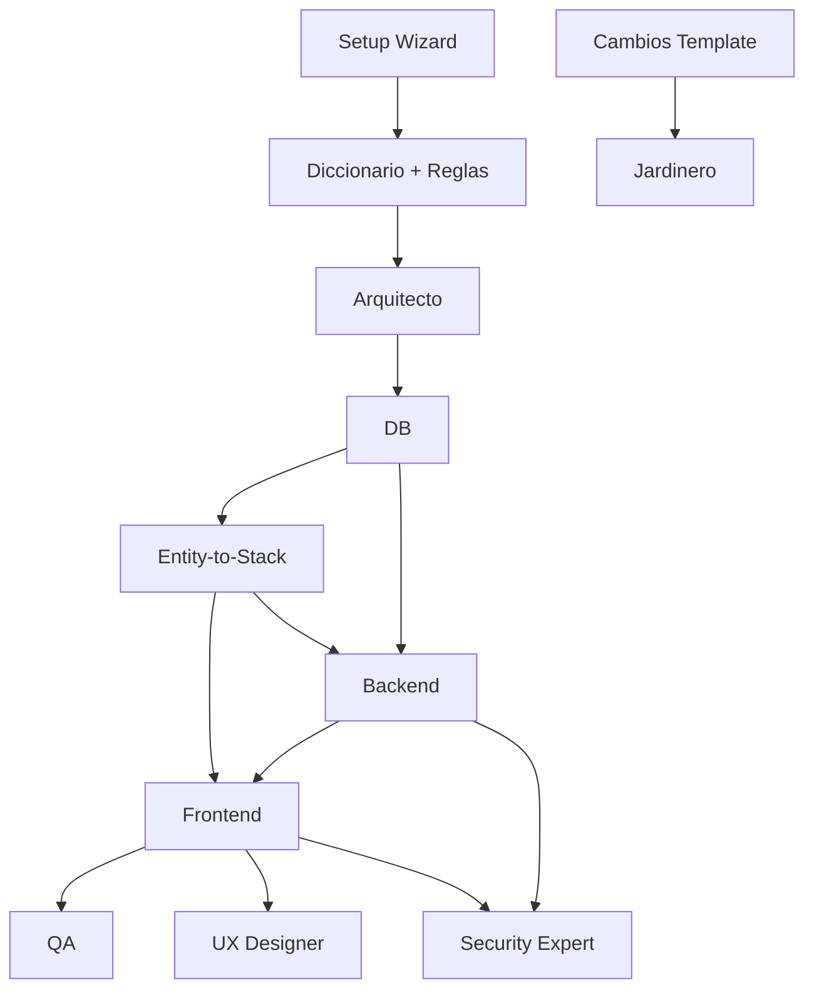

# 🔄 Documento Maestro de Flujos de Trabajo

Este documento es la **fuente única de verdad** para todos los flujos de trabajo del sistema IA_MANAGER_TEMPLATE. Consolida información que antes estaba dispersa en múltiples documentos.

**Referencias:** Este documento es referenciado desde `00_CORE_MANAGER/00_MANAGER.md`, `DOCS/AGENT_DEPENDENCIES.md` y `DOCS/MANUAL_FUNCIONAMIENTO.md`. Cuando necesites información sobre flujos, consulta este documento primero.

---

## 📋 Índice de Flujos

1. [Nuevo CRUD Completo](#1-nuevo-crud-completo)
2. [Añadir Nuevo DTO o Entidad al Sistema](#2-añadir-nuevo-dto-o-entidad-al-sistema)
3. [Generación Full-Stack desde Entidad](#3-generación-full-stack-desde-entidad)
4. [Bug o Error en Funcionalidad Existente](#4-bug-o-error-en-funcionalidad-existente)
5. [Cambio en Reglas de Negocio o Gobernanza](#5-cambio-en-reglas-de-negocio-o-gobernanza)
6. [Nueva Vista de Listado o Pantalla con Rejilla](#6-nueva-vista-de-listado-o-pantalla-con-rejilla)
7. [Cambios en el IA_MANAGER_TEMPLATE](#7-cambios-en-el-ia_manager_template)
8. [Nueva Funcionalidad con Elementos de UI](#8-nueva-funcionalidad-con-elementos-de-ui)

---

## 1. Nuevo CRUD Completo

**Cuándo usar:** Cuando el usuario solicita crear un CRUD completo (Create, Read, Update, Delete) para una nueva entidad.

**Flujo secuencial:**

1. **Arquitecto** (`AG-VC-01-ARCHITECT`)
   - Define entidades, límites de contexto y capas
   - Establece relaciones entre entidades si aplica
   - Documenta decisiones arquitectónicas si son relevantes

2. **DB** (`AG-VC-04-DB`)
   - Diseña tablas/migraciones
   - Actualiza `Historial_DB.md` con el cambio
   - Actualiza `Tablas_Columnas_Alias.md` con nueva tabla y columnas
   - Actualiza `Diccionario.md` (ENTIDADES PRINCIPALES) si es nueva entidad

3. **Backend** (`AG-VC-03-BACKEND`)
   - Crea entidad TypeORM
   - Crea DTOs (Create, Update, List, Detail)
   - Crea repositorio custom si es necesario
   - Crea servicio con lógica de negocio
   - Crea controlador con endpoints REST
   - Registra módulo en `app.module.ts`
   - Documenta endpoints en Swagger

4. **Frontend** (`AG-VC-02-FRONTEND`)
   - Crea modelo/interfaz TypeScript
   - Crea servicio Angular con `getData()` implementando `IEntityDataService<T>`
   - Crea componente listado (`xxx-general`) usando componentes Core
   - Crea componente formulario/detalle si aplica
   - Crea módulo de feature
   - Configura routing (`xxx-routing.module.ts`)
   - Registra ruta en `app-routing.module.ts`

5. **QA** (`AG-VC-05-QA`)
   - Valida cobertura de tests unitarios
   - Verifica casos límite
   - Valida integración Backend-Frontend

**Dependencias:** Arquitecto → DB → Backend → Frontend → QA

**Registro:** Registrar en `Audit_Logs.md` como "CRUD completo para entidad [nombre]"

**Referencias:**
- `00_CORE_MANAGER/00_MANAGER.md` → "FLUJOS DE ORQUESTACIÓN ESTÁNDAR" → "Nuevo CRUD completo"
- `DOCS/AGENT_DEPENDENCIES.md` → "Orden recomendado en flujos estándar"

---

## 2. Añadir Nuevo DTO o Entidad al Sistema

**Cuándo usar:** Cuando el usuario solicita añadir un nuevo DTO o estructura de base de datos al sistema de control (sin generar CRUD completo aún).

**Flujo:**

1. **DB** (`AG-VC-04-DB`)
   - Si la descripción o los campos no están claros, solicita al usuario que los indique
   - Actualiza `Diccionario.md` (ENTIDADES PRINCIPALES) con la nueva entidad
   - Actualiza `Tablas_Columnas_Alias.md` con nueva tabla/columnas, tipos, alias
   - Actualiza `Historial_DB.md` registrando el cambio

2. **Backend** (`AG-VC-03-BACKEND`) - Opcional, solo si se solicita implementación
   - Implementa entidad TypeORM según documentos actualizados
   - Crea DTOs según estructura documentada
   - Crea módulo básico
   - Crea endpoints según necesidad

**Dependencias:** DB → Backend (si aplica)

**Registro:** Registrar en `Audit_Logs.md` como "Nuevo DTO/entidad añadido al sistema: [nombre]"

**Referencias:**
- `00_CORE_MANAGER/00_MANAGER.md` → "FLUJOS DE ORQUESTACIÓN ESTÁNDAR" → "Añadir nuevo DTO o entidad"
- `02_AGENTS_REGISTRY/04_DATABASE.md` para proceso detallado del agente DB
- `DOCS/AGENTES_BD_Y_DTOs.md` para documentación completa

---

## 3. Generación Full-Stack desde Entidad

**Cuándo usar:** Cuando el usuario solicita "generar todo para la entidad X", "entidad X a full-stack", "CRUD completo desde entidad" o expresiones similares.

**Agente responsable:** **Entity-to-Stack** (`AG-VC-10-ENTITY-STACK`)

**Flujo completo:**

1. **Verificación inicial**
   - Entity-to-Stack verifica si la entidad está en el sistema de control (`Diccionario.md`, `Tablas_Columnas_Alias.md`)
   - Si no está, primero delega en **DB** (`AG-VC-04-DB`) para registrarla (ver flujo 2)

2. **Construcción de checklist**
   - Entity-to-Stack construye una checklist explícita de todos los artefactos Backend y Frontend que deben generarse
   - Checklist Backend: entidad, DTOs, módulo, controlador, servicio, registro en app.module
   - Checklist Frontend: modelo, servicio con getData(), componente listado con Core, módulo, routing, registro en app-routing

3. **Delegación Backend**
   - Entity-to-Stack delega en **Backend** (`AG-VC-03-BACKEND`) con la checklist completa
   - Backend implementa todos los artefactos según checklist
   - Backend confirma cuando está completo

4. **Delegación Frontend**
   - Tras confirmación del Backend, Entity-to-Stack delega en **Frontend** (`AG-VC-02-FRONTEND`) con la checklist completa
   - Frontend implementa todos los artefactos según checklist
   - Frontend confirma cuando está completo

5. **Validación final**
   - Entity-to-Stack valida que todos los entregables están completos
   - Verifica que no falte ningún artefacto de la checklist
   - Considera el flujo terminado solo cuando todo está completo

**Registro obligatorio:** Registrar en `Audit_Logs.md` cuando se use este flujo para "generación full-stack desde entidad [nombre]"

**Referencias:**
- `00_CORE_MANAGER/00_MANAGER.md` → "FLUJOS DE ORQUESTACIÓN ESTÁNDAR" → "Generación full-stack desde entidad"
- `02_AGENTS_REGISTRY/10_ENTITY_FULLSTACK.md` para detalles del agente

---

## 4. Bug o Error en Funcionalidad Existente

**Cuándo usar:** Cuando se detecta un bug, error o comportamiento incorrecto en funcionalidad ya implementada.

**Flujo:**

1. **QA** (`AG-VC-05-QA`)
   - Reproduce el bug
   - Genera reporte estructurado con:
     - Pasos para reproducir
     - Comportamiento esperado vs. actual
     - Posible causa raíz
     - Impacto

2. **Backend o Frontend** (según origen del bug)
   - Recibe el reporte de QA
   - Corrige la lógica manteniendo los tests verdes
   - Verifica que la corrección no rompe funcionalidad existente

3. **Arquitecto** (solo si aplica)
   - Interviene solo si el bug deriva de un problema de diseño/arquitectura
   - Propone solución arquitectónica si es necesario

**Dependencias:** QA → Backend/Frontend → Arquitecto (si aplica)

**Registro:** Registrar en `Audit_Logs.md` como "Bug corregido: [descripción breve]"

**Referencias:**
- `00_CORE_MANAGER/00_MANAGER.md` → "FLUJOS DE ORQUESTACIÓN ESTÁNDAR" → "Bug o error"
- `02_AGENTS_REGISTRY/05_QA_TESTING.md` para proceso del agente QA

---

## 5. Cambio en Reglas de Negocio o Gobernanza

**Cuándo usar:** Cuando se modifican reglas de negocio, se actualiza gobernanza del proyecto, o se cambian normas del template.

**Flujo:**

1. **Setup Wizard** (`AG-VC-06-SETUP`)
   - Ayuda a revisar impacto en `Diccionario.md` y `Reglas_Generales.md`
   - Actualiza términos de negocio si aplica
   - Documenta cambios en reglas

2. **Arquitecto** (`AG-VC-01-ARCHITECT`) - Si aplica
   - Ajusta arquitectura si el cambio de reglas lo requiere
   - Actualiza `Architecture_Decisions.md` si hay nuevas decisiones

3. **Jardinero** (`AG-VC-09-GARDENER`)
   - Limpia reglas obsoletas
   - Mantiene la documentación alineada
   - Valida coherencia del template si hay cambios en normas

**Dependencias:** Setup Wizard → Arquitecto (si aplica) → Jardinero

**Registro:** Registrar en `Audit_Logs.md` como "Cambio en reglas de negocio/gobernanza: [descripción]"

**Referencias:**
- `00_CORE_MANAGER/00_MANAGER.md` → "FLUJOS DE ORQUESTACIÓN ESTÁNDAR" → "Cambio en reglas"
- `01_GLOBAL_CONTEXT/Governance_Evolution.md` para evolución de gobernanza

---

## 6. Nueva Vista de Listado o Pantalla con Rejilla

**Cuándo usar:** Cuando se necesita crear una pantalla de listado, vista general, grid de datos, tabla de documentos/entidades.

**Agente responsable:** **Frontend** (`AG-VC-02-FRONTEND`)

**Reglas específicas de Core (OBLIGATORIAS):**

1. **Componentes Core obligatorios:**
   - `mobentis-entity-table-manager` (con `IEntityTableConfig` e `IEntityDataService`) - preferido
   - O alternativamente: `mobentis-table` + `mobentis-filter-container` + `mobentis-search-input` + `mobentis-pagination`

2. **Mandato en delegación:**
   - "Revisar la carpeta Core del Front y usar para el listado **mobentis-entity-table-manager** (con `IEntityTableConfig` e `IEntityDataService`) o, si no está disponible el módulo que lo exporta, al menos **mobentis-table** + **mobentis-filter-container** + **mobentis-search-input** + **mobentis-pagination**."
   - "No implementar tabla HTML manual ni input de búsqueda ni botón de filtros propios; el servicio de datos debe implementar `getData()` y llamar al API (POST .../list con `{ items, totalItems }`)."

3. **Validación a la entrega:**
   - Si el agente entrega una pantalla con `<table>` HTML manual para el listado principal y sin uso de los componentes Core anteriores, considerar la tarea **incompleta**
   - Registrar en `Technical_Debt.md` ("Listado [nombre] implementado sin componentes Core; pendiente refactor")
   - Solicitar refactor para usar `IEntityTableConfig`, servicio con `getData()` y componentes Core

**Prohibido:**
- Tablas HTML manuales (`<table>`)
- Inputs de búsqueda propios sin `mobentis-search-input`
- Botones de filtros sin `mobentis-filter-container`
- Datos solo mock sin servicio al API

**Referencias:**
- `00_CORE_MANAGER/00_MANAGER.md` → "CONTROL Y VALIDACIÓN DE CORE" → "Vistas de Listado"
- `DOCS/Core_Components_Catalog.md` para catálogo completo de componentes
- `01_GLOBAL_CONTEXT/Reglas_Generales.md` (regla 1.1 y estándares de listados)

---

## 7. Cambios en el IA_MANAGER_TEMPLATE

**Cuándo usar:** Tras modificar archivos del template (01_GLOBAL_CONTEXT, 02_AGENTS_REGISTRY, DOCS, etc.).

**Flujo:**

1. **Detección automática**
   - El Manager detecta cambios en archivos del template
   - Ofrece al usuario: *"Se han realizado cambios en el template. ¿Quieres que el Jardinero revise y actualice enlaces, referencias y documentación?"*

2. **Jardinero** (`AG-VC-09-GARDENER`) - Si el usuario acepta
   - Ejecuta auditoría de coherencia del template
   - Valida enlaces, referencias cruzadas, versiones
   - Propone o aplica correcciones según checklist en `02_AGENTS_REGISTRY/09_GARDENER.md`

3. **Invocación manual**
   - El usuario puede solicitar en cualquier momento:
     - *"Revisar el template"*
     - *"Auditar IA_MANAGER_TEMPLATE"*
     - *"Comprobar enlaces del template"*

4. **Auditoría periódica**
   - El Manager puede sugerir auditoría periódica cada N sesiones (por defecto cada 5 sesiones)
   - O cuando detecte que han pasado varios días sin revisión
   - El usuario puede aceptar, posponer o desactivar

**Herramientas disponibles:**
- Script de validación: `scripts/validate-template.ps1`
- Checklist manual: `DOCS/TEMPLATE_VALIDATION.md`

**Referencias:**
- `00_CORE_MANAGER/00_MANAGER.md` → "FLUJOS DE ORQUESTACIÓN ESTÁNDAR" → "Cambios en el IA_MANAGER_TEMPLATE"
- `02_AGENTS_REGISTRY/09_GARDENER.md` para checklist completo del Jardinero

---

## 8. Nueva Funcionalidad con Elementos de UI

**Cuándo usar:** Cuando se necesita crear o modificar interfaz de usuario (pantallas, botones, KPIs, tablas, filtros, gráficas, formularios, diálogos, inputs, etc.).

**Agente responsable:** **Frontend** (`AG-VC-02-FRONTEND`)

**Reglas de Core (OBLIGATORIAS):**

### Fase 1: Verificación de Core (antes de escribir código)

1. Listar los **elementos de UI** que la tarea requiere
2. Para cada elemento, **comprobar** si en la carpeta Core del Front (`paths.config.json` → `core_front` + `/components`) existe un componente reutilizable
3. Consultar `DOCS/Core_Components_Catalog.md` como fuente de verdad
4. Elaborar un **informe breve**: por cada elemento, indicar "Elemento X → componente Core: `mobentis-xxx`" o "Elemento X → **No existe en Core**"

### Fase 2: Decisión y ejecución

- Si **todos** los elementos tienen componente en Core:
  - Proceder a implementar usando **únicamente** esos componentes (sin crear nuevo HTML/componente)

- Si **algún** elemento figura como "No existe en Core":
  - **Detenerse** y **no crear** aún ningún componente ni markup nuevo
  - **Informar al usuario** con el informe de la Fase 1
  - Indicar qué elementos faltan en Core y que sería necesario crear componente(s) nuevo(s) fuera de Core
  - Preguntar explícitamente si desea que se continúe creando esos componentes fuera de Core
  - Solo **después de confirmación del usuario**, continuar con la implementación

### Validación a la entrega

- Verificar que en las plantillas HTML del entregable **no** aparezcan elementos genéricos que tengan equivalente en `DOCS/Core_Components_Catalog.md`
- Si aparecen elementos HTML propios cuando existe componente Core equivalente:
  - La entrega se considera **incompleta**
  - Registrar en `Technical_Debt.md` (ej: "Pantalla [nombre]: uso de HTML propio en lugar de componentes Core; pendiente refactor según Core_Components_Catalog.md")
  - Solicitar refactor o informar al usuario de la desalineación

**Prohibido:**
- Generar `<table>`, `<button>`, `<input>` de búsqueda/filtros u otro HTML propio para funcionalidad cubierta por un componente del catálogo
- Crear componentes nuevos sin haber comprobado Core primero
- Crear markup sin avisar al usuario cuando falta un componente en Core

**Referencias:**
- `00_CORE_MANAGER/00_MANAGER.md` → "CONTROL Y VALIDACIÓN DE CORE" → "Para Frontend (elementos de UI)"
- `02_AGENTS_REGISTRY/02_FRONTEND.md` → "PROTOCOLO DE INTERACCIÓN" → "Protocolo en dos fases"
- `01_GLOBAL_CONTEXT/Reglas_Generales.md` (regla 1.2)

---

## 🔗 Diagrama de Dependencias entre Agentes

---

## 📝 Notas sobre Flujos

- **Todos los flujos deben registrar actividad** en `Audit_Logs.md`
- **Los errores deben registrarse** en `Technical_Debt.md`
- **Las dependencias deben respetarse** para evitar que un agente trabaje sobre información aún no generada
- **Core inviolable aplica** a todos los flujos que involucren Frontend o Backend
- **La validación de Core es obligatoria** antes de considerar una tarea completa

---

## 🔄 Actualización de este Documento

Este documento debe actualizarse cuando:
- Se añade un nuevo flujo estándar
- Se modifica un flujo existente
- Se cambian las dependencias entre agentes
- Se añaden nuevas reglas o validaciones

**Responsable:** El Jardinero debe mantener este documento sincronizado con los flujos documentados en `00_MANAGER.md` y `AGENT_DEPENDENCIES.md`.

---

**Última actualización:** Este documento refleja los flujos estándar del template en su versión actual. Para cambios recientes, consultar `CHANGELOG.md`.
