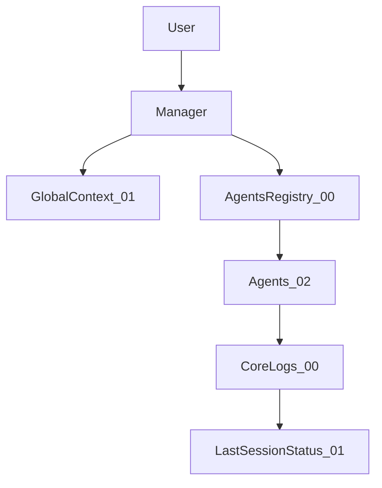

# 🚀 IA MANAGER TEMPLATE (ANTIGRAVITY ELITE)

**VERSION:** 1.1.0 (ver [CHANGELOG.md](./CHANGELOG.md) para historial de cambios y guía de migración).

Esta es una **Plantilla Maestra de Gobernanza y Orquestación IA** de Nivel 3 (Enterprise). Ha sido diseñada para transformar a Antigravity en un equipo de desarrollo completo, autónomo y auditable, capaz de gestionar proyectos de software complejos con rigor profesional.

---

## 🧠 ¿Cómo funciona?

El sistema se basa en una arquitectura de **Orquestación Basada en Agentes**. En lugar de interactuar con una IA genérica, trabajas con un ecosistema jerarquizado:

1.  **El Manager (00_MANAGER):** Recibe tus peticiones, consulta el contexto global y delega la ejecución al experto adecuado.
2.  **Los Agentes (02_AGENTS_REGISTRY):** Especialistas (v1.0–1.1) con reglas "de oro" inamovibles (Angular, Node, Seguridad, UX).
3.  **La Gobernanza (01_GLOBAL_CONTEXT):** Un conjunto de leyes técnicas (ADRs, Guardrails, Naming) que la IA no puede violar.
4.  **La Trazabilidad:** Cada cambio se registra en Logs de Auditoría, Historial de DB y Deuda Técnica.

---

## 📂 Estructura del Ecosistema

-   **/00_CORE_MANAGER**: El "Cerebro". Contiene el orquestador, el registro central, los **Audit Logs** y las reglas de orquestación del Manager.
-   **/01_GLOBAL_CONTEXT**: La "Constitución". Diccionario, Tech Stack, ADRs, Quality Standards, Naming, **Safety Guardrails**, **Backend_Patterns** (patrones y normas Back) y el checkpoint de sesión (`LAST_SESSION_STATUS.md`).
-   **/02_AGENTS_REGISTRY**: Los "Ejecutores". 11 agentes (Factory, Architect, Frontend, Backend, DB, QA, Setup, UX, Security, Gardener, Generador Entidad-FullStack). Consulta el índice en `02_AGENTS_REGISTRY/INDEX.md`.
-   **/03_PROMPT_LIBRARY**: La "Armería". Prompts maestros optimizados para tareas recurrentes (CRUDs, APIs, UX, Seguridad).
-   **/DOCS**: La "Bitácora". Incluye el **Manual de funcionamiento** (`DOCS/MANUAL_FUNCIONAMIENTO.md`), el **UI Storybook** y la configuración del orquestador.
-   **.agent/**: Configuración nativa para Antigravity con **aislamiento de workspace**.

---

## 🧩 Arquitectura de Orquestación

El flujo básico de este ecosistema es:

- El **usuario** pide una tarea.
- El **Manager** lee el contexto global (`01_GLOBAL_CONTEXT`) y el registro de agentes (`00_CORE_MANAGER/AGENTS_REGISTRY.json`).
- El Manager delega la ejecución en los **agentes especializados** (`02_AGENTS_REGISTRY`).
- La actividad y posibles atajos se registran en los **logs core** (`Audit_Logs.md`, `Technical_Debt.md`).
- El estado de la sesión se resume en `01_GLOBAL_CONTEXT/LAST_SESSION_STATUS.md` para poder continuar en futuras sesiones.

---

> [!TIP]
> **Si eres nuevo en el proyecto:** Empieza por [DOCS/ONBOARDING.md](./DOCS/ONBOARDING.md) — qué leer primero, cómo hacer tu primera tarea y dónde encontrar ayuda.

---

## 🔧 Guía de Preparación (Quick Start)

Para incorporar esta plantilla a un nuevo proyecto, sigue estos pasos:

1.  **Copia la carpeta:** Copia todo el contenido de `IA_MANAGER_TEMPLATE` a la raíz de tu nuevo proyecto.
2.  **Ejecuta el Setup:**
    - Abre PowerShell en la carpeta raíz.
    - Ejecuta `./setup_project.ps1`.
    - Introduce el **Nombre del Proyecto** (ej. `Ecomerce_IA`) y el **Código** (ej. `ECOM`).
    - *El script configurará automáticamente las rutas absolutas y los tokens en todos los archivos.*
3.  **Hidratación Inicial:** 
    - Abre el chat con Antigravity.
    - Escribe `/ia-init` (o simplemente di "Hola, configura el proyecto").
    - El **Setup Wizard** te ayudará a rellenar el `Diccionario.md` basándose en tu idea de negocio.
4.  **Script de introspección de BD (si aplica):** Si el backend está en el mismo repo que este template, asegúrate de que exista el fichero `scripts/sync-schema-to-docs.ts` en la raíz del backend. Si no existe o se ha perdido, ejecuta desde la raíz del backend: `npm run template:init-sync-script`. Eso copia la copia canónica desde `IA_MANAGER_TEMPLATE/scripts/sync-schema-to-docs.ts` para que el comando `npm run db:sync-docs` esté disponible. El script no contiene datos de conexión; todo se lee del `.env` del backend.

---

## 🤖 Cómo trabajar en el día a día

-   **Delegación:** No necesitas llamar a los agentes. Simplemente pide la tarea (ej: "Crea una página de productos") y el **Manager** aplicará los flujos estándar descritos en `00_CORE_MANAGER/00_MANAGER.md` (por ejemplo, Arquitecto → DB → Backend → Frontend → QA para un CRUD completo).
-   **Continuidad:** Al inicio de cada sesión, el Manager lee `01_GLOBAL_CONTEXT/LAST_SESSION_STATUS.md` para recordar la última tarea, el backlog y las decisiones clave, y así reanudar el trabajo sin perder contexto.
-   **Seguridad:** El sistema bloqueará automáticamente cualquier acción que viole los `01_GLOBAL_CONTEXT/AI_Safety_Guardrails.md`.
-   **Calidad:** Al terminar una tarea, pide una "Auditoría de Calidad" y el agente **QA** o **Security** revisará el código contra los estándares definidos.
-   **Atajos de uso:** Usa `02_AGENTS_REGISTRY/INDEX.md` para ver qué sabe hacer cada agente y la `03_PROMPT_LIBRARY` para copiar prompts maestros como `CRUD Master`, `API Endpoint`, `UX Polishing` o `Security Audit`.
-   **Coherencia del template:** Tras modificar archivos del template (reglas, agentes, contexto global), el Manager puede ofrecerte que el **Jardinero** revise y actualice enlaces, referencias y documentación. También puedes pedir en cualquier momento *"Revisar el template"* o *"Auditar IA_MANAGER_TEMPLATE"* para validar que todo esté correctamente enlazado y actualizado.
-   **Multia-proyecto:** Si tienes varios proyectos abiertos, Antigravity detectará en cuál estás trabajando por la pestaña activa y usará el Manager correspondiente.

---

> [!IMPORTANT]
> **Nunca modifiques los archivos de 02_AGENTS_REGISTRY manualmente.** Si necesitas cambiar el comportamiento de un agente, utiliza el `02_AGENTS_REGISTRY/00_AGENT_FACTORY.md` para realizar una refactorización controlada.

---
> [!TIP]
> Consulta la [PROMPT_LIBRARY](./03_PROMPT_LIBRARY/README.md) para acelerar tu desarrollo al máximo. Para una guía completa del sistema: [Manual de funcionamiento](./DOCS/MANUAL_FUNCIONAMIENTO.md).

---

## 🌐 Orquestador único en el workspace

Si este template está en un **workspace con varios proyectos** (Front, Back, etc.):

- Se ha configurado **`.cursor/rules/`** en la **raíz del workspace** para que el orquestador sea siempre este (`IA_MANAGER_TEMPLATE`).
- **No copies** el template a cada proyecto; usad esta instancia como **fuente única** de agentes, skills y normas.
- Al crear un nuevo proyecto dentro del mismo workspace, no hace falta volver a configurar el orquestador; la regla en la raíz aplica a todo el workspace.

Detalles en `DOCS/WORKSPACE_ORCHESTRATOR_SETUP.md`.